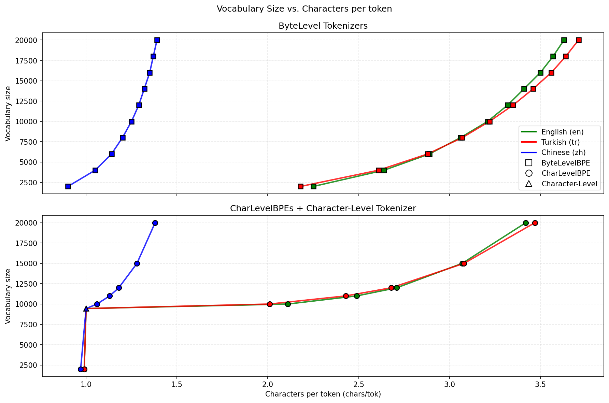
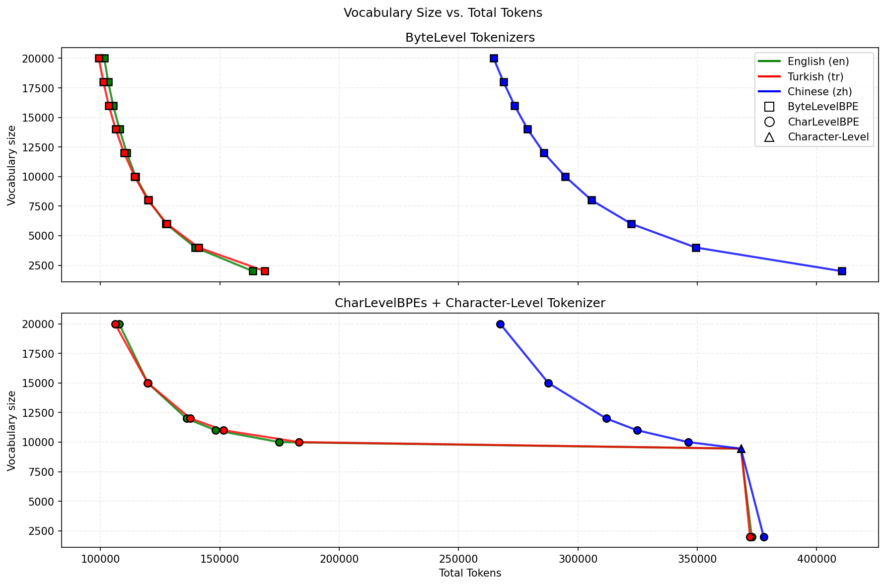
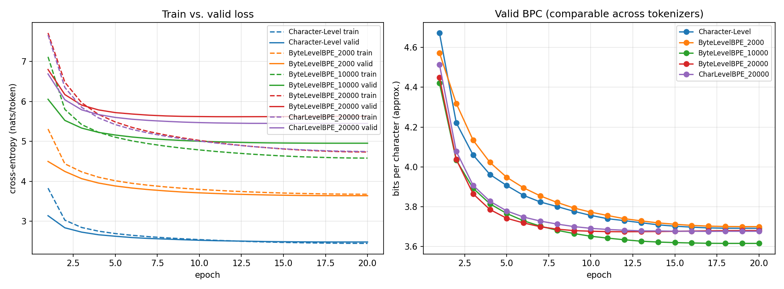
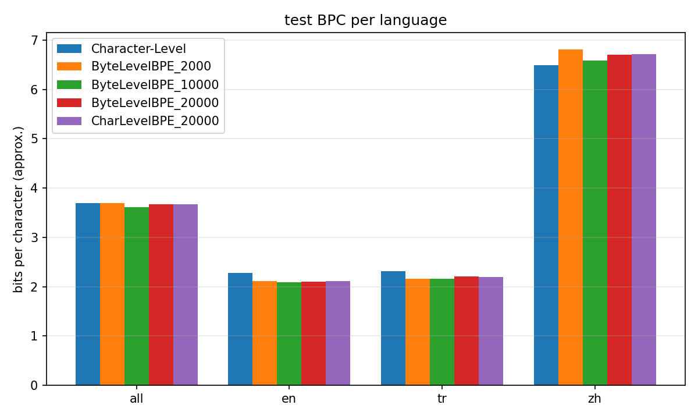
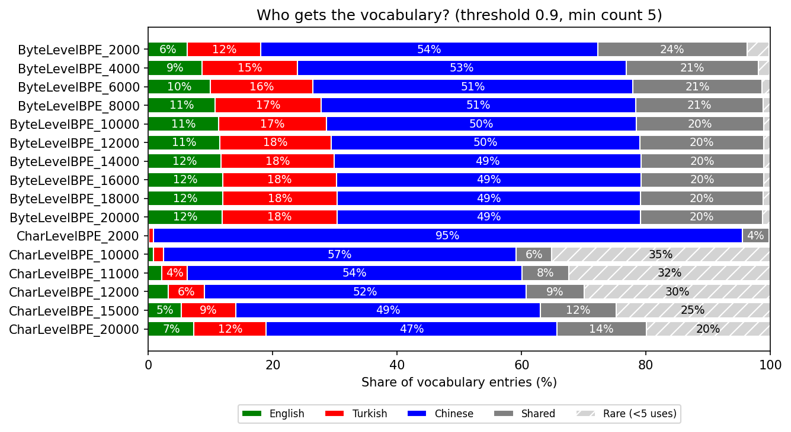

# Tokenization & Language Modeling in English, Turkish & Chinese

**Author:** Andreas Bartsiokas, [_github repository_](https://github.com/mparts/multilingual-tokenization-and-language-modeling)

## Abstract

Training of character-level and BPE tokenizers (byte-level and character-level, 2k–20k vocabulary) on a balanced English/Turkish/Chinese corpus. Trainning of a small Transformer LM per tokenizer, and compare them with bits per character (BPC). A mid-sized byte-level BPE (10k) is best overall. English and Turkish gain from BPE, Chinese does not.

## Part 1: Setup

- **Data:** Leipzig Wikipedia sentences (en, tr, zh), balanced by Unicode characters ($\approx$ 3.68M chars/language). `train/` for tokenizers and LMs, `valid/` for decisions, `test/` only for the final run.
- **Tokenizers:**
  - **Char:** vocabulary from train only (9,446 types incl. 4 specials). Unseen characters → `<UNK>` (valid: 0.013% en, 0.004% tr, 0.070% zh).
  - **Byte_V:**  Byte-level BPE (using HuggingFace), 256 byte alphabet, lossless (0% UNK).
  - **CharBPE_V:** BPE over characters (using HuggingFace) (Metaspace pre-tokenizer, `<UNK>`).
- **Vocabulary sizes:** 2k and 10k (suggested), 20k as the "substantially larger" one. Because Chinese alone gives a character vocabulary of $\approx$ 9k, a 2k character-level BPE cannot even cover the alphabet (4.85% of zh tokens are UNK Table 1). Byte-level BPE avoids this. I additionally swept 2k–20k (Table 6).

## Part 2: Tokenizers

### 2.1 Predictions (before experiments)

- **P1** Chinese needs the most tokens (most diverse).
- **P2** Larger BPE $\Rightarrow$ fewer tokens/sentence in all languages. Chinese benefits most.
- **P3** BPE learns frequent affixes and function words (*and*, *the*) for en/tr. Unsure for zh (frequent sequences or word-like units).
- **P4** A moderately sized BPE will model best. The best size may depend on the language.
- **Checkpoint question:** how well does byte-level BPE do compared to the other tokenizers?

### 2.2 Statistics (validation set)

- **P1 (supported for BPE):** zh needs $\approx$ 2.6× the tokens of en/tr at 10k–20k (265–295k vs. 99–115k) for the same number of characters. At char level all are equal by construction.
- Tokens/sentence is misleading across languages (zh sentences are short in characters). chars/token is the fair measure.
- Byte-2k makes zh longer than char-level (410k vs. 368k tokens, 0.90 chars/token): most Chinese characters (3 bytes) are not merged. 35% of the zh token stream are partial-byte fragments.
- **P2 (partly):** Byte-2k→20k cuts tokens by 38% (en), 41% (tr), 35% (zh). Turkish gains slightly more than English. Chinese gains least.

**Table 1: Tokenizer statistics on the validation set.** _T = tokens, S = sentence, C = characters_

| Tokenizers  | |       |    T  |       | |       |  T/S  |       | |      | C/T  |      |
|-------------|-|-------|-------|-------|-|-------|-------|-------|-|------|------|------|
|             | | en    | tr    | zh    | |en     | tr    | zh    | |en    |  tr  | zh   |
| Char        | | 368.3 | 368.4 | 368.3 | | 81.12 | 98.63 | 38.55 | | 1.00 | 1.00 | 1.00 |
| Byte-2k     | | 163.8 | 168.8 | 410.5 | | 36.08 | 45.20 | 42.96 | | 2.25 | 2.18 | 0.90 |
| Byte-10k    | | 114.7 | 114.3 | 294.7 | | 25.27 | 30.60 | 30.84 | | 3.21 | 3.22 | 1.25 |
| Byte-20k    | | 101.6 | 99.3  | 264.7 | | 22.37 | 26.58 | 27.70 | | 3.63 | 3.71 | 1.39 |
| CharBPE-2k  | | 372.8 | 372.1 | 377.8 | | 82.12 | 99.63 | 39.55 | | 0.99 | 0.99 | 0.97 |
| CharBPE-10k | | 174.8 | 183.1 | 346.2 | | 38.50 | 49.03 | 36.23 | | 2.11 | 2.01 | 1.06 |
| CharBPE-20k | | 107.8 | 106.1 | 267.4 | | 23.75 | 28.40 | 27.99 | | 3.42 | 3.47 | 1.38 |

UNK rate (zh): Char 0.07%, CharBPE-2k 4.85%, CharBPE-10k 0.08%, CharBPE-20k 0.10%. Byte-level 0%.  
Source: [save_9/tokenizers/tokenizer_stats.json](./../data/manual_saves/9_Gather_All_Tokenizers/tokenizers/tokenizer_stats.json).

| Figure 1: Characters per token vs. vocabulary size. | Figure 1.5: Total tokens vs. vocabulary size. |
|:---:|:---:|
|  |  |

### 2.3 Examples

- **P3:** en/tr: function words and suffixes (`the`, `of`, `ve`, `bir`, `lar`, `ler`). Turkish suffixes are split off (`lar|dan`) and whole words appear at 10k (`lardan`, `kayı`). Rare names fragment (`Sc|and|in|av|ian`, `K|art|ac|alı|lar`).
- **zh:** merges are rare. Most tokens stay single characters. Byte-10k holds $\approx$ 2k pure multi-character Chinese tokens. The corpus mixes simplified and traditional forms, which splits the statistics.
- **Why:** BPE merges frequent adjacent pairs. English/Turkish have a small alphabet and highly repetitive character sequences, so merges pay off quickly. Chinese has thousands of characters of lower individual frequency, so the same number of merges buys much less compression.

Source: [docs/Submission_Checkpoint/tokenized_sentences.txt](./../docs/Submission_Checkpoint/tokenized_sentences.txt)   
Examples for all tokenizers: [save_9/tokenizers/tokenized_sentences.json](./../data/manual_saves/9_Gather_All_Tokenizers/tokenizers/tokenized_sentences.json)

## Part 3: Language models

### 3.1 Architecture and training

- Decoder-only Transformer, identical in all conditions: 2 layers, d=256, 4 heads, FF 1024, GELU, pre-LN, learned positions, dropout 0.1, context 256. Output layer is not tied to the input embedding.
- AdamW, lr 1e-3, 200 warm-up steps + cosine decay, batch 32, grad-clip 1.0, bf16 autocast. Checkpoint with best validation loss kept.
- **Data stream:** sentences shuffled across languages, each wrapped in `<BOS>…<EOS>`, concatenated and cut into 256-token blocks.
- **Main runs:** 20 epochs, seed 0, on mltgpu GPU.

### 3.2 Training-control policy

- **Policy:** same number of complete epochs (20) over the same text, so every model sees exactly the same underlying data.
- **Why:** simple, equal text exposure.
- **Limitation:** unequal updates and compute. Char got 22,260 optimizer steps, Byte-20k only 9,700, and the cosine schedule scales with step count. time/epoch ranged from 31 s (Byte-2k) to 76 s (Char).

### 3.3 Parameters

**Table 3: Parameter counts.** Share = (input emb. + output) / total. Non-embedding part is constant (1.58M) plus 65k positional parameters.

| Model | Total | Input emb. | Output | Emb. share |
|---|---|---|---|---|
| Char | 6.48M | 2.42M | 2.42M | 75% |
| Byte-2k | 2.67M | 0.51M | 0.51M | 38% |
| Byte-10k | 6.77M | 2.56M | 2.56M | 76% |
| Byte-20k | 11.89M | 5.12M | 5.12M | 86% |
| CharBPE-20k | 11.89M | 5.12M | 5.12M | 86% |

### 3.4 Learning curves and problems

*Figure 2: Training and validation loss, 20 epochs (run 5).*

- **Overfitting grows with vocabulary:** final train/valid loss gap 0.04 (Char), 0.37 (Byte-10k), 0.90 (Byte-20k). Best validation epoch: Char 20, Byte-2k 19, Byte-10k 20, Byte-20k 12, CharBPE-20k 17. (Train loss includes dropout, so gaps are understated.)
- **Token-level loss is not comparable between models** (Byte-20k valid loss 5.6 vs. Char 2.5), hence BPC (Sec. 4).
- **Changes / failed choices:**
  1. First implemented character-level BPE (CharBPE) and only later byte-level BPE after discussing the assignment. Kept both.
  2. CharBPE-2k loses the Chinese alphabet (4.85% UNK) and gives misleadingly good zh BPC (see Sec. 4).
  3. 10 epochs were not converged, so main comparison moved to 20 epochs.
  4. Seed-noise runs added (Table 5).

Source: [5_20E_TEST/train.json](./../data/manual_saves/5_20E_TEST/train.json).

## Part 4: Evaluation and analysis

### 4.1 Metric

$$ \mathrm{BPC} = -\frac{1}{N_{\mathrm{characters}}} \sum_t \log_2 p(x_t). $$

BPC measures the code length of the same text, independent of how it is segmented, so it is comparable across tokenizers. Approximations: token count includes `<BOS>`/`<EOS>`, the incomplete last block is dropped, and languages are scored in separate streams. BPC is comparable *across models within a language*, not across languages (a Chinese character carries more information than a Latin letter).

### 4.2.1 Test results

**Table 4: Test BPC, 20 epochs, seed 0 (run 5_20E_TEST).**

| Model       | all       | en        |tr         | zh        |
|-------------|-----------|-----------|-----------|-----------|
| Char        | 3.690     | 2.277     | 2.311     | **6.490** |
| Byte-2k     | 3.697     | 2.113     | 2.165     | 6.813     |
| Byte-10k    | **3.609** | **2.083** | **2.159** | 6.587     |
| Byte-20k    | 3.668     | 2.101     | 2.201     | 6.707     |
| CharBPE-20k | 3.672     | 2.109     | 2.192     | 6.712     |

*Figure 3: Test BPC per language and model.*

Source: [5_20E_TEST/test.json](./../data/manual_saves/5_20E_TEST/test.json)

### 4.2.2 Seed noise

**Table 5: Seed variation** (seeds 0, 1, 2). Spread $\lesssim$ 0.01 BPC, so differences $\geq$ 0.05 are treated as real. Only 3 models/3 seeds.

| Model | seed 0 | seed 1 | seed 2 |
|---|---|---|---|
| Char | 3.822 | 3.833 | 3.821 |
| Byte-10k | 3.719 | 3.726 | 3.717 |
| CharBPE-20k | 3.749 | 3.750 | 3.749 |

Source: [save_1/valid.json](./../data/manual_saves/1_10E_Char_Char2k-10k_Byte2k-10k/valid.json) & [save_7/valid.json](./../data/manual_saves/7_Seed1_Char_Byte10k_Char20k/valid.json) & [save_8/valid.json](./../data/manual_saves/8_Seed2_Char_Byte10k_Char20k/valid.json)

### 4.2.3 Vocabulary sweep

**Table 6: Valid BPC** (10 epochs, seed 0). Byte-level improves up to $\approx$ 10k and then plateaus (within noise) while parameters double.  
_† Invalid: 4.85% of zh tokens are UNK._

| V | 2k | 4k | 6k | 8k | 10k | 12k | 14k | 16k | 18k | 20k |
|---|---|---|---|---|---|---|---|---|---|---|
| Byte | 3.868 | 3.806 | 3.785 | 3.748 | 3.719 | 3.721 | 3.722 | 3.721 | 3.715 | 3.720 |

Source: [save_3/valid.json](./../data/manual_saves/3_10E_ByteBPE-2k-4k-6k-8k-10k/valid.json) & [save_6/valid.json](./../data/manual_saves/6_10E_ByteBPE-10k-12k-14k-16k-18k-20k/valid.json)

| V | 2k (†) | 10k | 11k | 12k | 15k | 20k |
|---|---|---|---|---|---|---|
| CharBPE | 3.645 | 3.764 | 3.775 | 3.760 | 3.752 | 3.749 |

Source: [save_2/valid.json](./../data/manual_saves/2_10E_CharBPE-10k-11k-12k-15k-20k/valid.json)

**Main observations**

- Byte-10k is best overall and on en/tr (3.609, −0.08 vs. Char). Char is best on zh (6.490).
- Byte-10k and Char have almost the same size (6.77M vs. 6.48M), so the gap is not a parameter effect. The 20k models are larger and worse.
- BPE helps en by 0.16–0.19 and tr by 0.11–0.15 BPC. For zh, every BPE model is worse than Char (+0.10 to +0.32).
- Byte-20k vs. CharBPE-20k are nearly equal (3.668 vs. 3.672), byte-level is clearly better at 10k (valid, run 1: 3.719 vs. 3.764).

### 4.3 Returning to the checkpoint

- **H1: "Chinese requires the most tokens."** Expected: zh longest.
  - Result: **supported** under BPE (Table 1).
  - Chinese character diversity limits merging. It also has the worst BPC, but this cannot be compared directly with en/tr.
- **H2: "Larger BPE helps Chinese most."** Expected: largest gain for zh.
  - Result: **contradicted.** Token counts fall for all languages (zh least, −35% vs. −38%/−41%), and zh BPC is best at char level and rises from Byte-10k to Byte-20k (6.587 → 6.707)
  - Shorter sequences do not help if the added tokens are sparse (see Sec. 4.5).
- **H3: "A moderately sized BPE works best."** Expected: middle size best.   
  - Result: **supported overall** (Byte-10k). It is language-dependent: en/tr prefer BPE, zh prefers characters, so a single shared tokenizer is a compromise.
  - 2k is too small to compress, beyond 10k extra tokens are rare and the embedding/output layers (86% of parameters at 20k) overfit.
- **H4 / question: byte-level vs. the rest.**
  - Byte-level is better than CharBPE at 10k and equal at 20k, and does not suffer from unknown tokens. 
  - It is more robust but pays for byte fragments in Chinese at small V.

### 4.4 Who gets the vocabulary?

**Method.** Counted on train. For token *t* and language *l*: 
- ratel(t) = countl(t) / #charsl
- sharel(t) = ratel(t) / Σl' ratel'(t). _Token belongs to *l* if sharel $\geq$ 0.9, else *shared*._
- *rare* if < 5 occurrences. 
- Overlap: Jaccard of tokens used $\geq$ 5 times in two languages.

**Table 7: Vocabulary allocation** (threshold 0.9). _"Stream share": fraction of a language's tokens that belong to its own class (rest mostly shared)._ E = Entries, S = Stream share, J = Jaccard

|Tokenizer    | |      |      | E    |        |      | |     |S    |     | |       | J     |       |
|-------------|-|------|------|------|--------|------|-|-----|-----|-----|-|-------|-------|-------|
|             | |  en  | tr   | zh   | shared | rare | |  en | tr  | zh  | | en-tr | en-zh | tr-zh |
| Byte-2k     | | 125  | 237  | 1083 | 480    | 71   | | .22 | .34 | .92 | | .75   | .38   | .33   |
| Byte-10k    | | 1125 | 1739 | 4977 | 2049   | 106  | | .42 | .50 | .92 | | .45   | .23   | .19   |
| Byte-20k    | | 2378 | 3694 | 9749 | 3926   | 249  | | .50 | .56 | .92 | | .34   | .16   | .13   |
| CharBPE-20k | | 1466 | 2322 | 9344 | 2877   | 3987 | | .46 | .54 | .93 | | .42   | .16   | .13   |

*Figure 4: Vocabulary allocation.*

- Chinese owns about half of the vocabulary at every size (4,977/10,000 and 9,749/20,000 for Byte), yet its chars/token stays at 1.25–1.39. Capacity goes to a long tail of individual characters, not to compression.
- English–Turkish sharing shrinks with V: Jaccard 0.75 (2k) → 0.45 (10k) → 0.34 (20k). At small V they share letters and punctuation, larger V buys language-specific words and suffixes.
- At 10k–20k only 42–50% (en) and 50–56% (tr) of the token stream is covered by language-specific tokens. the rest is shared (punctuation, short fragments, digits).
- Byte fragments (not valid characters alone): 35% of the zh stream at 2k, 7% at 10k, 3% at 20k, < 1% for en/tr.
- CharBPE-20k leaves 3,987 entries (20%) rare (< 5 uses): presumably rare characters occupy vocabulary that Byte-20k spends on merges.
- **Examples (most frequent):** 
  - en `the`, `of`, `and`,
  - tr `ve`, `bir`, `lar`, `olarak`, `için`
  - for zh look at: `vocab_alocation.json` _(because of pdf encoding strugling with chinese chars)_ 
  - shared `.`, `,`, `-`, `s`, `a`.

Source: [save_9/tokenizers/vocab_allocation.json](./../data/manual_saves/9_Gather_All_Tokenizers/tokenizers/vocab_allocation.json)

### 4.5 Relating tokenization to model behavior

**Pattern:** a larger vocabulary compresses zh better (0.90 → 1.39 chars/token) but its BPC does not improve (Byte: 6.813, 6.587, 6.707 at 2k/10k/20k, Char 6.490).

**Evidence:**

- **Compression:** zh sequences shorten 35% from 2k to 20k.
- **Allocation:** half of each vocabulary is Chinese, mostly sparse single characters or rare multi-character units.
- **Parameters:** Byte-20k has 11.9M parameters, 86% of them in embedding and output layers.
- **Curves:** the train/valid gap is 0.90 for Byte-20k, best validation epoch 12 of 20.
- **BPC:** en/tr benefit (2.28 → 2.08 en), zh does not.

**Interpretation:** with a fixed amount of data, many sparse zh tokens are seen too few times to learn, the model overfits instead of using the shorter sequence. For en/tr the merged units are frequent, so the gain from shorter sequences outweighs the larger softmax. The small difference between 10k and 20k in en/tr and the plateau in the sweep suggest that frequent units are exhausted around 10k.

## Part 5 Conclusion

- **Supported:** a moderately sized BPE works best (H3): Byte-10k has the lowest overall test BPC (3.609) at about the same size as Char, larger vocabularies add parameters without gain (sweep plateau, overfitting).
- **Not supported / surprising:** Chinese does not benefit from larger BPE (H2), char-level is best for zh (6.490 vs. 6.587) although its sequences are 25% longer (368k vs. 295k tokens).
- **Shared tokenizer:** one vocabulary serves en and tr well (they share letters and many fragments) but Chinese takes about half of the vocabulary for little compression. A shared tokenizer favours the Latin-script languages.
- **Choice:** byte-level BPE with $\approx$ 10k tokens: best overall, no UNK, robust to rare characters, and no parameter inflation. If Chinese were the only priority, character-level would be preferable.
- **Caveats:** one seed for the main 20-epoch comparison, small 2-layer model, epoch-matched (not compute-matched) training, approximate BPC, no tuning per tokenizer (e.g. learning rate).
